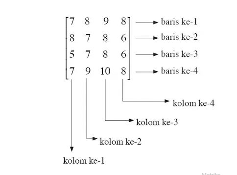

Matriks adalah susunan angka atau objek matematika lainnya yang disusun dalam bentuk baris dan kolom, dimana operasi seperti penjumlahan dan perkalian dapat didefinisikan.Ordo atau ukuran matriks menunjukkan banyaknya baris dan kolom di dalam matriks. Transpose matriks merupakan bentuk operasi matriks di mana susunan baris diubah menjadi kolom, sedangkan bagian kolom diubah menjadi baris.

Operasi Dasar Matriks

Ada sejumlah operasi dasar yang dapat diterapkan untuk memodifikasi matriks. Operasi dasar pada matriks meliputi penambahan matriks, perkalian skalar, transposisi, perkalian matriks, operasi baris, dan submatriks.

Macam-macam matriks antara lain yaitu :

1. Matriks Bujur Sangkar
2. Matriks Diagonal
3. Matriks Skalar
4. Matriks identitas
5. Matriks simetrik
6. Matriks anti simetris
7. Matriks Segitiga atas (Upper triangular)
8. Matriks Segitiga bawah (Lower triangular)
